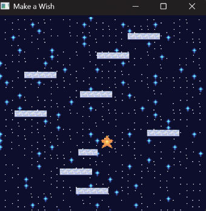

# Make a Wish

Author: Raeshana Sookhoo

Design: 

 
  
[SPOILER] 

   Takes advantage of double rectangle overlaps to get an upwards boost.
    Is needed to clear all the squares (most times).

Screen Shot:

How To Play:

(TODO: describe the controls and (if needed) goals/strategy.)
All that cheese is actually the moon...well, a star.
You play as a star trying to get rid of (square) clouds in the sky by jumping on them.
Landing on a cloud tile springs you upwards.
Use left and right arrow keys to move the star in that direction.
Every round is randomized, and in most cases, will require abusing the collision system.

## Extra Credit

Are your Physics Deterministic? If so, how can we verify this?
Yes it is!
In main, there is a fixed delta time of 1/60.
It is used to call update at fixed/ set intervals rather than on each frame.
There is also an accumulator that checks if the amount of 'leaked' time can trigger update.
This way, we can be certain that a frame is updated every 1/60 seconds.
Can be checked by running the game multiple times and/ or on different devices with the same inputs.
Physics simulators should yield the same output every time.
Can also be checked by turning off vsync.
Physics simulators should yield the same output as when vsync is on.

Are your Physics Rewindable? If so, how can we verify this?
No :(

This game was built with [NEST](NEST.md).
